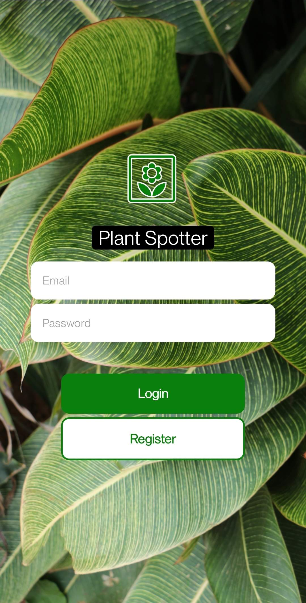
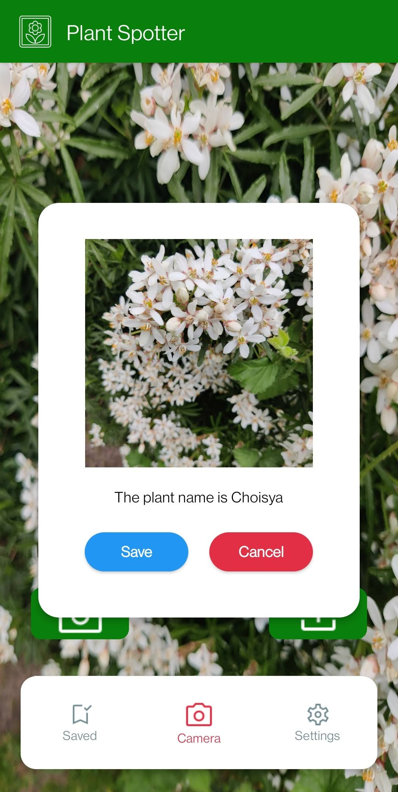

# Plant Spotter
An app for identifying plants. By taking a picture or uploading a photo of a plant it will suggest the best result from the [plant.id API](https://plant.id/).

This app was a solo project for the CodeWorks coding bootcamp and was built within a week. Presentation of the app is [here](https://www.youtube.com/watch?v=9dDHbwZbm78)

## ScreenShots
 
<section style="display: flex; justify-content: space-evenly;">
  
  
  
</section>

\
This app is built for testing and educational purposes and is not intended to be published. Built using React-Native with Expo and Firebase authentication for the front-end. Node JS, [Express](https://expressjs.com/), [MongoDB](https://www.mongodb.com/) with [Mongoose](https://mongoosejs.com/) for the back-end. I had used [Ngrok](https://ngrok.com/) to publicly service the localhost for testing. Requests from back-end sent to [plant.id API](https://plant.id/) to identify plants.

## Setup

To run this clone the repo and run <code>npm install</code> in both the `client` and `server` directories.

1. You will need an API key from [plant.id API](https://plant.id/). API documentation can be found [here](https://github.com/flowerchecker/Plant-id-API). Edit the API key in `server/ApiService.js`

2. It is best to setup an NGROK server which is a public server that mimics your localhost for the back-end. Sign up and instructions [here](https://ngrok.com/). When running an ngrok server you will get the url. Change the url in `client/baseUrl.js`

3. It is recommended to use the expo-cli to run the app. To download this run `npm install -g expo-cli` 

4. You can download Expo Go from the Google Play or iOS store on your phone. To run the app on your phone, run `expo start --tunnel`

5. Once started, a QR-code will be displayed in the terminal which your Expo Go app can scan and run the app.